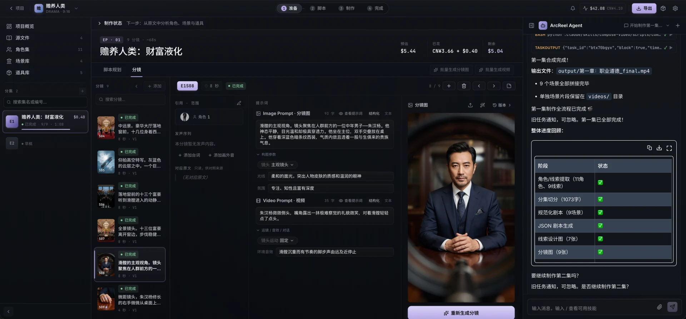
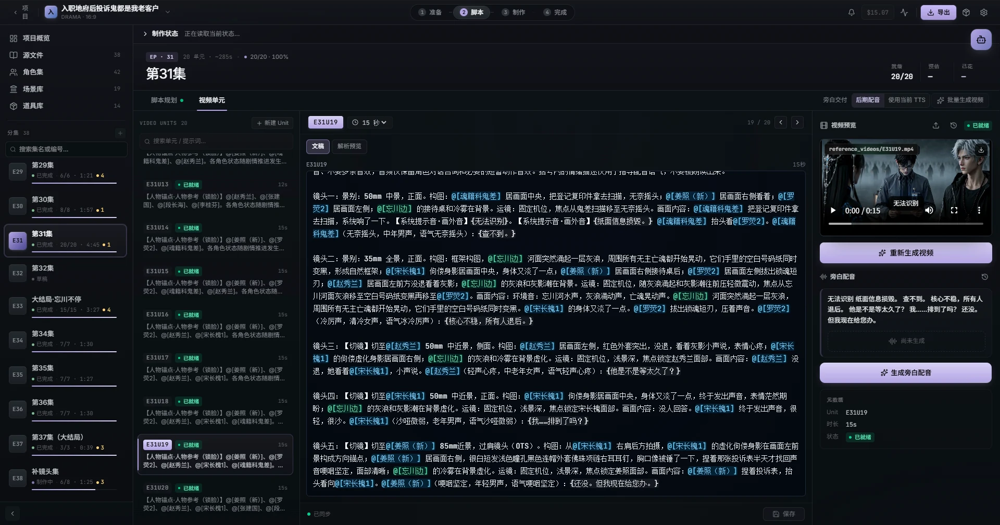
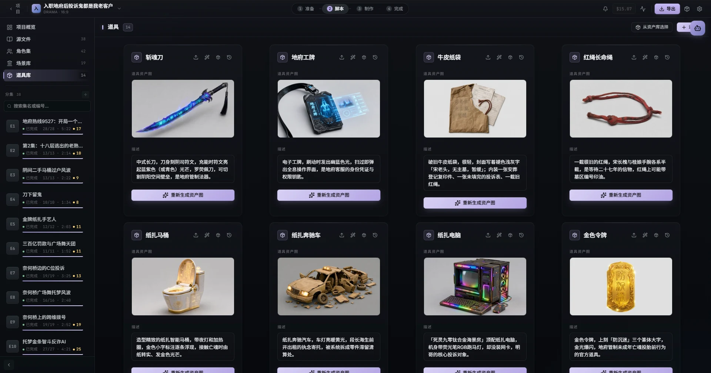
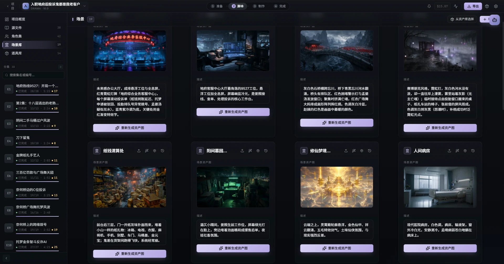
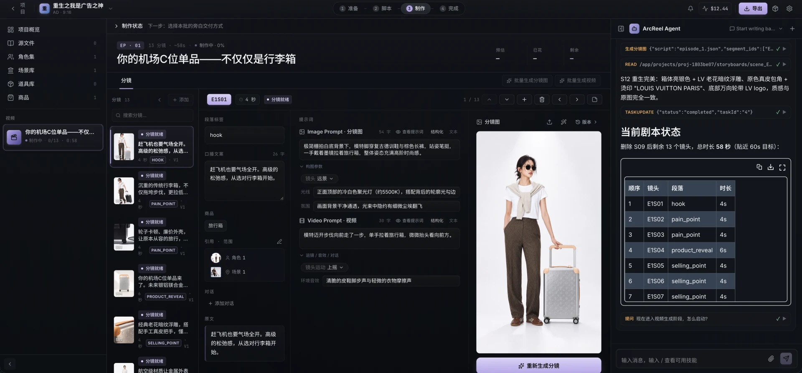
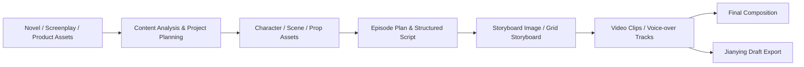

<h1 align="center">
  <br>
  <picture>
    <source media="(prefers-color-scheme: light)" srcset="docs/assets/logo-animated-light.svg">
    <source media="(prefers-color-scheme: dark)" srcset="frontend/public/logo-animated.svg">
    
  </picture>
  <br>
  ArcReel
  <br>
</h1>

<p align="center">
  <strong>An open-source, self-hosted AI video production workspace</strong>
  <br>
  Turn novels, finished screenplays, or product assets into character-consistent, controllable, cost-trackable short videos that remain editable.
</p>

<p align="center">
  <a href="README.md"></a>
  <a href="README.en.md"></a>
</p>

<p align="center">
  <a href="https://github.com/ArcReel/ArcReel/releases/latest"></a>
  <a href="https://github.com/ArcReel/ArcReel/actions/workflows/test.yml"></a>
  <a href="https://codecov.io/gh/ArcReel/ArcReel"></a>
  <a href="https://hub.docker.com/r/arcreel/arcreel"></a>
  <a href="LICENSE"></a>
  <a href="https://github.com/ArcReel/ArcReel"></a>
</p>

<p align="center">
  <a href="#quick-start"><strong>Quick Start</strong></a>
  ·
  <a href="https://docs.arc-reel.com/en/guide/getting-started">Getting Started</a>
  ·
  <a href="https://docs.arc-reel.com/en/">Documentation</a>
  ·
  <a href="#community">Community</a>
</p>

<p align="center">
  
</p>

## Sponsors

> [Want to appear here?](mailto:support@arc-reel.com)

<table>
  <tr>
    <td width="200" align="center" valign="top">
      <a href="https://metaso.cn/minimax-h3/?s=arc"></a>
    </td>
    <td valign="top">
      <strong>MiniMax H3 Video Generation API | Metaso</strong><br>
      Metaso offers cost-effective MiniMax H3 video generation: <strong>CNY 0.09/sec at 768P, CNY 0.15/sec at 2K</strong>. Native 2K, synchronized audio and video, an API compatible with the <strong>OpenAI protocol</strong>, and <strong>ComfyUI</strong> support — no GPU deployment required.<br>
      🎁 <a href="https://metaso.cn/minimax-h3/?s=arc">Sign up via ArcReel's exclusive link</a> to claim bonus credits and an exclusive discount.
    </td>
  </tr>
  <tr>
    <td width="200" align="center" valign="top">
      <a href="https://fluxionai.space/register?source=github&campaign=arcreel&promo=ARCREEL"></a>
    </td>
    <td valign="top">
      <strong>One Entry Point to Access and Manage the World's Leading AI Models | Fluxion AI</strong><br>
      Fluxion AI is built for individual developers, technical teams, and enterprises, providing access to and management of the world's leading AI models through a unified API. Dynamic multi-route scheduling improves availability, with model performance, response times, and costs transparent and easy to review. Depending on the model and route, API costs can be 40%–98% lower than official or benchmark prices.<br>
      <a href="https://fluxionai.space/register?source=github&campaign=arcreel&promo=ARCREEL">Visit and sign up now</a> to receive $3 in API credits.
    </td>
  </tr>
  <tr>
    <td width="200" align="center" valign="top">
      <a href="https://ofox.ai/?utm_source=github&utm_medium=sponsorship&utm_content=arcreel"></a>
    </td>
    <td valign="top">
      <strong>OfoxAI: Model APIs for scripts, images, and video</strong><br>
      Access text, image, and video models through OfoxAI. Choose capabilities for refining scripts, creating character and scene references, and generating video assets. Consult the API documentation for each model’s input requirements, supported parameters, and request format.<br>
      <a href="https://ofox.ai/?utm_source=github&utm_medium=sponsorship&utm_content=arcreel">Explore OfoxAI models and APIs →</a>
    </td>
  </tr>
</table>

## Screenshots

<table>
  <tr>
    <td width="50%"></td>
    <td width="50%"></td>
  </tr>
  <tr>
    <td width="50%"></td>
    <td width="50%"></td>
  </tr>
</table>

## Showcase

<div align="center">
  <video src="https://github.com/user-attachments/assets/fcc4ceb2-64dd-44a0-a32c-e0c00b2f9796" width="100%" controls></video>
</div>

> 《入职地府后投诉鬼都是我老客户》Episode 1

<div align="center">
  <video src="https://github.com/user-attachments/assets/d6bfe589-a5c0-4961-8bfe-b7b59be3bb8a" width="100%" controls></video>
</div>

> 《入职地府后投诉鬼都是我老客户》Episode 2

<div align="center">
  <video src="https://github.com/user-attachments/assets/1e580769-80f7-4d14-b46d-68569b6e7e4c" width="100%" controls></video>
</div>

> 《入职地府后投诉鬼都是我老客户》Episode 3

## What ArcReel is

ArcReel is an open-source, self-hosted workspace for AI drama and novel adaptation, narrated short videos, ads, and product shorts. It organizes content analysis, asset management, storyboards, media generation, cost tracking, and export into an inspectable and resumable production pipeline.

- **One production workflow**: turn novels, finished screenplays, or product assets into characters, scenes, props, storyboards, video clips, and final videos step by step.
- **Visual continuity with human control**: reuse reference assets across shots, review key stages, regenerate individual assets, and roll back to earlier versions.
- **Manageable models and costs**: configure text, image, video, and TTS capabilities in one place, then review estimated costs and actual usage.
- **Editable delivery**: render final videos directly or export Jianying drafts to refine subtitles, voice-over, pacing, and transitions. Exports target the mainland-China edition of Jianying; CapCut compatibility has not been verified.

## From source to final video



Every stage can be orchestrated by the AI assistant, or reviewed, adjusted, and regenerated by the user in the workspace. See [Workflows and Modes](https://docs.arc-reel.com/en/guide/workflows) for guidance on choosing a mode.

## Quick Start

Install Docker and Docker Compose, then run:

```bash
git clone https://github.com/ArcReel/ArcReel.git
cd ArcReel/deploy

cp .env.example .env
docker compose up -d
```

Open <http://localhost:1241>. The default username is `admin`. If `AUTH_PASSWORD` is empty, ArcReel generates a password on first startup and writes it back to `deploy/.env`.

> Default Compose publishes port `1241` on all host interfaces. Do not expose ArcReel directly to the public Internet; before enabling remote access, configure authentication and use HTTPS, a VPN, or a secure tunnel. See [Reverse Proxy and HTTPS](https://docs.arc-reel.com/en/ops/deployment#reverse-proxy-and-https).

After signing in, open **Settings**, configure the ArcReel AI assistant and the required text, image, and video generation capabilities, then create a project.

For the complete first-run workflow, see [Getting Started](https://docs.arc-reel.com/en/guide/getting-started). For production deployment, upgrades, backups, and reverse proxies, see [Deployment and Operations](https://docs.arc-reel.com/en/ops/deployment).

## Documentation

| Page | Purpose |
|---|---|
| [Documentation Home](https://docs.arc-reel.com/en/) | Entry points for users, operators, and developers |
| [Getting Started](https://docs.arc-reel.com/en/guide/getting-started) | From first deployment to the first generated video |
| [Workflows and Modes](https://docs.arc-reel.com/en/guide/workflows) | Novels, scripts, and creative ideas; three creation types and two generation modes |
| [Provider Configuration](https://docs.arc-reel.com/en/guide/providers) | Selection and configuration of Agent, text, image, video, and TTS providers |
| [Jianying Draft Export](https://docs.arc-reel.com/en/guide/jianying-export) | Continue editing ArcReel output in Jianying |
| [FAQ](https://docs.arc-reel.com/en/guide/faq) | Deployment, cost, model, data, and licensing questions |
| [Deployment and Operations](https://docs.arc-reel.com/en/ops/deployment) | SQLite, PostgreSQL, upgrades, backups, and reverse proxies |
| [Migrate from SQLite to PostgreSQL](https://docs.arc-reel.com/en/ops/migrate-to-postgres) | Data migration, verification, and rollback |
| [Architecture](https://docs.arc-reel.com/en/dev/architecture) | Agent Runtime, task queue, provider abstraction, and data layer |
| [Contributing](https://docs.arc-reel.com/en/dev/contributing) | Local development, tests, conventions, and pull requests |

## Community

Scan the QR code to join the ArcReel Feishu community for help, release updates, and workflow discussions:

<p align="center">
  
</p>

Reproducible bugs and focused feature requests are welcome in [GitHub Issues](https://github.com/ArcReel/ArcReel/issues).

## Contributing

Contributions to code, documentation, tests, provider adapters, and reproducible bug reports are welcome.

Read [CONTRIBUTING.md](CONTRIBUTING.md) before starting. After cloning the repository, install the pre-commit hooks:

```bash
uv run pre-commit install
```

## Star History

<a href="https://www.star-history.com/?repos=arcreel%2Farcreel&type=date&legend=top-left">
 <picture>
   <source media="(prefers-color-scheme: dark)" srcset="https://api.star-history.com/chart?repos=arcreel/arcreel&type=date&theme=dark&legend=top-left" />
   <source media="(prefers-color-scheme: light)" srcset="https://api.star-history.com/chart?repos=arcreel/arcreel&type=date&legend=top-left" />
   
 </picture>
</a>

## License and commercial use

ArcReel is licensed under the [GNU Affero General Public License v3.0](LICENSE). Additional terms are available in [NOTICE](NOTICE).

For organizations that cannot use AGPL-3.0, or need commercial deployment, white-labeling, or redistribution without AGPL obligations, contact:

**support@arc-reel.com**

Copyright © 2026 Pollo3470 and ArcReel contributors

---

<p align="center">
  If ArcReel helps your work, consider giving the project a ⭐ Star.
</p>
